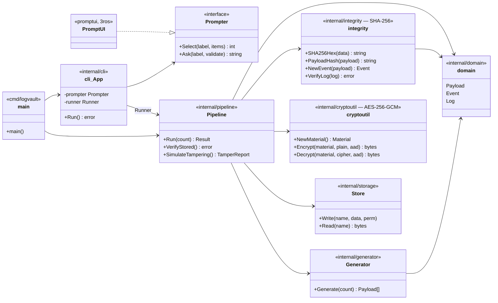

# Diagrama de estructura (paquetes y dependencias)

Renderizar en https://mermaid.live y exportar a PNG/SVG para el ZIP.

```mermaid
classDiagram
    direction LR

    class main {
        <<cmd/logvault>>
        +main()
    }

    class cli_App {
        <<internal/cli>>
        -prompter Prompter
        -runner Runner
        +Run() error
    }
    class Prompter {
        <<interface>>
        +Select(label, items) int
        +Ask(label, validate) string
    }
    class PromptUI {
        <<promptui, 3ros>>
    }

    class Pipeline {
        <<internal/pipeline>>
        +Run(count) Result
        +VerifyStored() error
        +SimulateTampering() TamperReport
    }

    class Generator {
        <<internal/generator>>
        +Generate(count) Payload[]
    }
    class integrity {
        <<internal/integrity — SHA-256>>
        +SHA256Hex(data) string
        +PayloadHash(payload) string
        +NewEvent(payload) Event
        +VerifyLog(log) error
    }
    class cryptoutil {
        <<internal/cryptoutil — AES-256-GCM>>
        +NewMaterial() Material
        +Encrypt(material, plain, aad) bytes
        +Decrypt(material, cipher, aad) bytes
    }
    class Store {
        <<internal/storage>>
        +Write(name, data, perm)
        +Read(name) bytes
    }
    class domain {
        <<internal/domain>>
        Payload
        Event
        Log
    }

    main --> cli_App
    main --> Pipeline
    cli_App --> Prompter
    PromptUI ..|> Prompter
    cli_App --> Pipeline : Runner
    Pipeline --> Generator
    Pipeline --> integrity
    Pipeline --> cryptoutil
    Pipeline --> Store
    Generator --> domain
    integrity --> domain
    Pipeline --> domain
```
