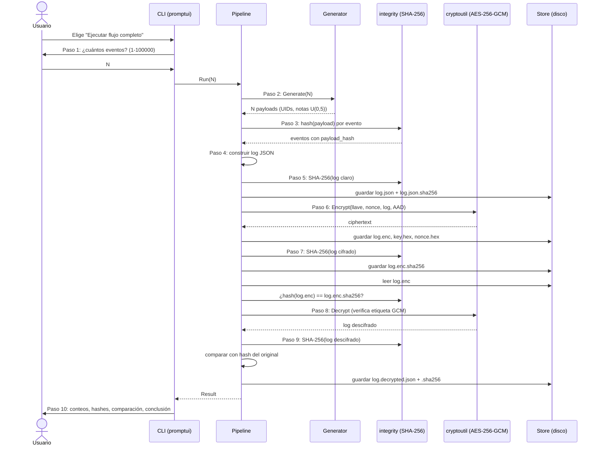

# Diagrama de comportamiento (secuencia de los 10 pasos)

Renderizar en https://mermaid.live y exportar a PNG/SVG para el ZIP.

```mermaid
sequenceDiagram
    actor U as Usuario
    participant C as CLI (promptui)
    participant P as Pipeline
    participant G as Generator
    participant I as integrity (SHA-256)
    participant K as cryptoutil (AES-256-GCM)
    participant S as Store (disco)

    U->>C: Elige "Ejecutar flujo completo"
    C->>U: Paso 1: ¿cuántos eventos? (1-100000)
    U->>C: N
    C->>P: Run(N)
    P->>G: Paso 2: Generate(N)
    G-->>P: N payloads (UIDs, notas U(0,5))
    P->>I: Paso 3: hash(payload) por evento
    I-->>P: eventos con payload_hash
    P->>P: Paso 4: construir log JSON
    P->>I: Paso 5: SHA-256(log claro)
    P->>S: guardar log.json + log.json.sha256
    P->>K: Paso 6: Encrypt(llave, nonce, log, AAD)
    K-->>P: ciphertext
    P->>S: guardar log.enc, key.hex, nonce.hex
    P->>I: Paso 7: SHA-256(log cifrado)
    P->>S: guardar log.enc.sha256
    P->>S: leer log.enc
    P->>I: ¿hash(log.enc) == log.enc.sha256?
    P->>K: Paso 8: Decrypt (verifica etiqueta GCM)
    K-->>P: log descifrado
    P->>I: Paso 9: SHA-256(log descifrado)
    P->>P: comparar con hash del original
    P->>S: guardar log.decrypted.json + .sha256
    P-->>C: Result
    C->>U: Paso 10: conteos, hashes, comparación, conclusión
```
